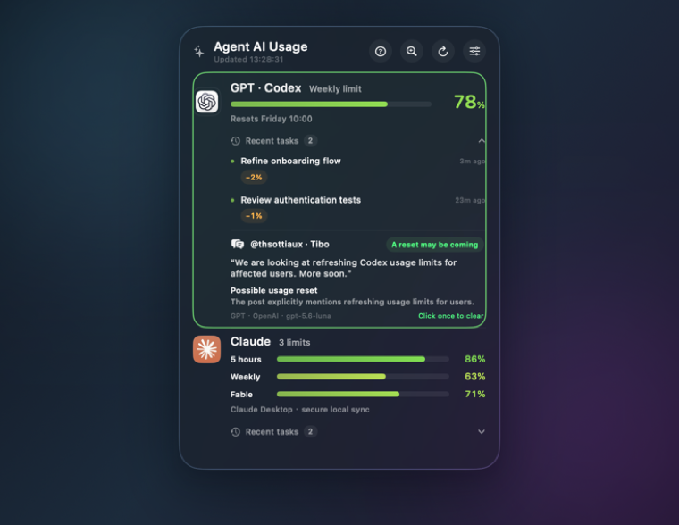

# Agent AI Usage

English | [简体中文](README.zh-CN.md) | [繁體中文](README.zh-CNF.md) | [日本語](README.ja.md)

A native macOS desktop widget for monitoring GPT / Codex and Claude usage without keeping a dashboard in front of your work.



## Features

- Shows GPT / Codex and Claude usage in one compact native widget.
- Claude displays 5-hour, weekly, and Fable limits at the same time.
- Refreshes and re-detects services every 30 seconds.
- Attributes usage changes to the latest Codex or Claude task.
- Keeps up to three recent tasks per provider; Claude shows every changed usage window separately.
- Watches Tibo (`@thsottiaux`) for new posts and can ask OpenAI, Claude, Gemini, or DeepSeek whether they may signal a GPT / Codex quota reset.
- Also supports custom OpenAI-compatible endpoints by Base URL, optional API key, and dynamically loaded model list.
- Keeps the latest post and a concise AI verdict below GPT tasks; a possible reset turns the GPT card green until you click it once.
- Supports an optional HTTP/Mixed proxy for Tibo and AI traffic, preset to Clash's common `127.0.0.1:7890` address with an editable port and connection test.
- Lives at the Finder desktop layer, behind normal application windows.
- Supports English, Simplified Chinese, Traditional Chinese, and Japanese.
- Uses native Liquid Glass on macOS 26 and a native visual-effect fallback on earlier systems.

## Data and privacy

GPT / Codex usage is read from the local Codex read-only app-server interface. Claude's 5-hour and weekly values are read from Claude Desktop's own local usage history. The app does not read, copy, or upload Claude Desktop session cookies.

Fable is a model-scoped limit that Claude Desktop may not write to its local history. If Fable shows `—`, open Settings and choose **Connect Fable usage** for one-time official Claude Code authorization. An Anthropic Admin API key with a custom monthly budget is also available as an optional fallback.

By default, Tibo monitoring only needs the public profile link `https://x.com/thsottiaux`; no X developer credential is required. It tries the direct public profile, X's embedded timeline, and a read-only backup reader in parallel. The official X API with a Bearer Token remains available as an advanced fallback when the public routes are unavailable.

Choose OpenAI, Claude, Gemini, DeepSeek, or Custom OpenAI-compatible, enter the required API information, test the connection to load available models, and select one. Custom endpoints accept an API Base URL such as `https://api.example.com/v1`; local services such as LM Studio may use `http://localhost`. Automatic checks run every two minutes; the sparkle button next to Refresh checks immediately and reanalyzes the latest post.

Credentials entered in Settings are stored in macOS Keychain. Opening Settings and testing the public profile never reads saved secrets; Keychain is accessed only when you explicitly test a model or when a newly detected post needs AI analysis. An unchanged background check does not access it. Usage history, the three most recent task records, and the latest Tibo analysis stay on the Mac. Only the text of a newly detected Tibo post is sent to the AI provider you select.

## Requirements

- macOS 14 or later
- ChatGPT / Codex signed in locally for GPT usage
- Claude Desktop or Claude Code signed in locally for Claude usage
- Swift 6 command-line tools to build from source

## Build

```bash
./build.sh
```

The signed local build is written to `dist/Agent AI Usage.app`.

## Troubleshooting

- GPT missing: open ChatGPT or Codex, confirm you are signed in, then press Refresh.
- Claude missing: open Claude Desktop once so it updates its local usage history.
- Fable missing: use **Settings → Connect Fable usage**.
- Tibo analysis missing: test the public profile and AI provider connections in Settings, then press the sparkle button. If the public routes report a connection failure, check your network, VPN, or proxy, wait and retry, or switch to the official X API fallback.
- Clash is running but X still fails: enable the custom proxy in Tibo Settings, keep `127.0.0.1:7890` or enter Clash's current HTTP/Mixed port, then use **Test proxy** followed by **Test public profile**.
- The widget is missing: use the menu-bar item **Show widget on this display**.

## License

[PolyForm Noncommercial 1.0.0](LICENSE). Personal and other noncommercial use is allowed; commercial use is not licensed.

Why aren't there any other providers? Because I only subscribe to GPT and Claude.
