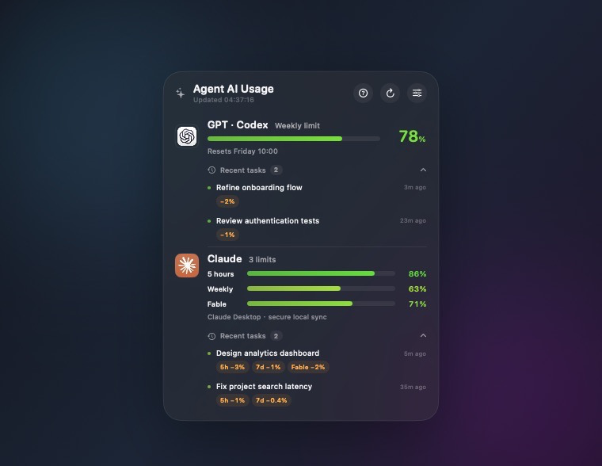

# Agent AI Usage

[English](README.md) | 简体中文 | [日本語](README.ja.md)

一个原生 macOS 桌面小组件，用来同时监控 GPT / Codex 与 Claude 额度，不会遮挡正在使用的窗口。



> 截图来自应用的隔离演示模式。任务名称和百分比全部为虚构数据，不包含桌面或账号信息。

## 功能

- 在一个紧凑的原生组件里显示 GPT / Codex 和 Claude 额度。
- Claude 同时显示 5 小时、本周和 Fable 三项限制。
- 剩余额度越多越绿，越少越红。
- 每 30 秒刷新并重新检测服务，启动后才登录也无需重启应用。
- 将额度变化归因到最近的 Codex 或 Claude 任务。
- 每家最多保留三条最近任务，Claude 会分别显示每个变化的额度窗口。
- 位于 Finder 桌面层，普通应用窗口会盖住它。
- 刷新按钮左侧有故障排查说明。
- 支持英语、简体中文和日语，默认英语。
- macOS 26 使用原生 Liquid Glass，旧系统使用原生视觉效果回退。

## 数据与隐私

GPT / Codex 额度来自本机 Codex 只读 app-server 接口。Claude 的 5 小时和本周数据来自 Claude Desktop 自己的本地额度历史。应用不会读取、复制或上传 Claude Desktop 的会话 Cookie。

Fable 是模型专属限制，Claude Desktop 可能不会将它写入本地历史。如果显示 `—`，请在设置中点击“连接 Fable 额度”完成一次 Claude Code 官方授权。也可选择使用 Anthropic Admin API Key 与自定义月预算。

在设置中填入的凭证保存于 macOS 钥匙串。额度历史与最近三条任务只保存在本机。

## 要求与构建

- macOS 14 或更高版本
- 本机已登录 ChatGPT / Codex 和 Claude Desktop / Claude Code
- 从源码构建需要 Swift 6 命令行工具

```bash
./build.sh
```

成品位于 `dist/Agent AI Usage.app`。

## 验收

```bash
# 隔离模拟数据验收
.build/release/QuotaMonitor --acceptance

# 加上当前 Mac 真实登录的只读验证
.build/release/QuotaMonitor --acceptance-live
```

本版本已通过全部 14 项验收，包括 GPT / Codex 和 Claude 真实冷启动读取。

## 许可证

[PolyForm Noncommercial 1.0.0](LICENSE)：允许个人和其他非商业用途，不授权商业使用。
